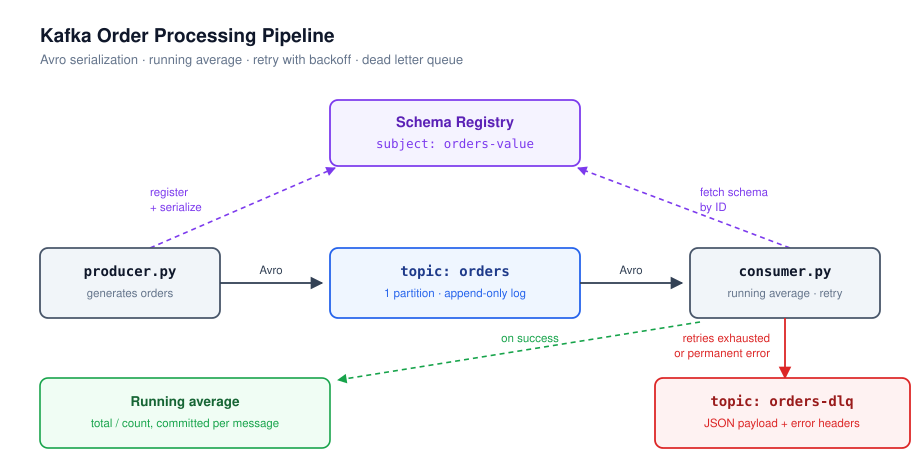

# Kafka Order Processing Pipeline

EC 8203 — Applied Big Data Engineering

A Kafka-based event pipeline that produces and consumes order messages using Avro
serialization, computes a running average of prices, retries transient failures with
exponential backoff, and routes permanently failed messages to a Dead Letter Queue.

---

## Requirements Coverage

| Requirement | Where it is implemented |
|---|---|
| Kafka producer and consumer | `producer.py`, `consumer.py` |
| Avro serialization | `order.avsc`, registered via `register_schema.py` |
| Real-time aggregation (running average) | `consumer.py`(`total` / `count` accumulator) |
| Retry logic for temporary failures | `consumer.py`(`handle_with_retry()`) |
| Dead Letter Queue | `consumer.py` (`send_to_dlq()` → `orders-dlq` topic) |


---


## Architecture



---

## Project Structure

```
kafka-orders/
├── docker-compose.yml     Kafka (KRaft), Schema Registry, Kafka UI
├── order.avsc             Avro schema for the Order record
├── register_schema.py     Registers the schema under subject "orders-value"
├── catalog.py             Fixed product catalogue (name → price)
├── producer.py            Generates orders, serializes to Avro, produces
├── consumer.py            Consumes, aggregates, retries, routes to DLQ
├── requirements.txt       Pinned Python dependencies
└── README.md
```

---

## Setup

### 1. Start the infrastructure

```bash
docker compose up -d
docker compose ps
```

Three containers should be running:

| Service | Port | Purpose |
|---|---|---|
| Kafka broker | 9092 | Message log |
| Schema Registry | 8081 | Avro schema storage and compatibility checks |
| Kafka UI | 8080 | Web dashboard |

Open <http://localhost:8080> and confirm the cluster shows **online**.

### 2. Create the topics

```bash
docker exec kafka kafka-topics --bootstrap-server localhost:29092 \
  --create --topic orders --partitions 1 --replication-factor 1

docker exec kafka kafka-topics --bootstrap-server localhost:29092 \
  --create --topic orders-dlq --partitions 1 --replication-factor 1
```

### 3. Python environment

```bash
python -m venv venv
venv\Scripts\activate          # Windows
pip install -r requirements.txt
```

### 4. Register the Avro schema

```bash
python register_schema.py
# → Registered with schema ID: 1
```

### 5. Run

Two terminals:

```bash
python consumer.py
```
```bash
python producer.py
```

---

## Message Schema (`order.avsc`)

```json
{
  "type": "record",
  "name": "Order",
  "namespace": "com.assignment.orders",
  "fields": [
    {"name": "orderId", "type": "string"},
    {"name": "product", "type": "string"},
    {"name": "price",   "type": "float"}
  ]
}
```

Registered under subject `orders-value` (Confluent's default `<topic>-value`
naming strategy).

---

## How It Works

### Producer

Selects a random item from a fixed catalogue and produces it to `orders`. Each
product has a **fixed price**, so the same SKU always costs the same — this makes
the running average converge toward the catalogue mean (~53) rather than drifting
randomly, which demonstrates that the aggregation is genuinely accumulating.

The message key is `orderId`. `acks=all` is set so the broker only acknowledges
once the write is durable, and `flush()` runs on shutdown so no buffered message
is lost on Ctrl+C.

### Consumer — running average

Maintains `total` and `count` in memory and recomputes `total / count` after each
successfully processed order. Failed orders are excluded from the aggregate.

### Consumer — retry logic

Failures are classified into two types:

| Type | Trigger | Behaviour |
|---|---|---|
| `PermanentError` | `price <= 0` (invalid business data) | No retries — straight to DLQ |
| `TransientError` | Simulated downstream unavailability | Up to 3 retries with backoff |

Backoff is exponential: **0.5s → 1.0s → 2.0s**. If all attempts fail, the message
goes to the DLQ tagged `RETRIES_EXHAUSTED`.

### Consumer — Dead Letter Queue

Failed messages are produced to `orders-dlq` with the original payload intact and
diagnostics carried in Kafka **headers**:

| Header | Example |
|---|---|
| `error_reason` | `PERMANENT` / `RETRIES_EXHAUSTED` |
| `error_message` | `Invalid price -1.0` |
| `attempts` | `0` / `3` |
| `original_topic` | `orders` |
| `original_offset` | `4878` |
| `failed_at` | `2026-09-10T07:22:31.343696+00:00` |

---

## Design Decisions

**Avro over JSON.** Avro sends field names once (at schema registration) rather
than in every message, so payloads are roughly half the size. More importantly,
serialization fails at the *producer* if a field is missing or mistyped, so
malformed records never enter the topic at all. Schema Registry additionally
rejects incompatible schema changes: attempting to change `price` from `float` to
`string` returns HTTP 409, because existing consumers reading already-written
float data would break.

**Single partition.** Partitions are the unit of parallelism, but the required
aggregation is *global*. With N partitions and N consumers, each consumer would
hold its own `sum` and `count` and produce a partial average — the state would be
fragmented across processes. One partition gives total ordering and one correct
average. (If the requirement were average *per product*, multiple partitions keyed
by product would be the right design.)

**Manual offset commits.** `enable.auto.commit` is disabled and `commit()` is
called explicitly after processing. Auto-commit runs on a 5-second timer regardless
of whether processing succeeded, which would advance the offset past a message
still being retried. Committing manually after the work gives **at-least-once**
delivery and is what makes retry meaningful — the message remains unfinished from
Kafka's perspective for the whole retry loop.

**Transient vs permanent failures.** Retrying invalid data is wasted time: a
negative price will still be negative on the third attempt. Failing fast on
permanent errors sends them to the DLQ immediately, while transient errors get the
retry budget they can actually benefit from.

**Exponential backoff.** If a downstream service is overloaded, retrying at a
fixed short interval adds load and makes recovery less likely. Increasing the wait
between attempts gives the service room to recover.

**DLQ write before offset commit.** `send_to_dlq()` calls `flush()`, which blocks
until the broker acknowledges the write, and only then does `commit()` run.
`produce()` alone is asynchronous — committing without flushing could advance the
offset while the DLQ write sits unsent in a buffer, losing the message from both
topics. The rule is: **persist the failure before advancing the offset.**

**JSON (not Avro) in the DLQ.** A message may reach the DLQ precisely *because*
Avro deserialization failed. Requiring Avro on the DLQ would make that case
unrecordable. A permissive format is deliberate for a failure sink.

**Metadata in headers, not in the payload.** Keeping the original order untouched
in the message value means a DLQ entry can be replayed back into `orders` without
stripping anything out. Diagnostics ride alongside in headers.

---

## Head-of-Line Blocking

Processing is strictly sequential within the partition: message N+1 is not read
until N is resolved. An exhausted retry therefore pauses the consumer for ~3.5
seconds (0.5 + 1.0 + 2.0).

This delay is bounded and intentional. Without a DLQ, an unprocessable message
would leave only two options: retry forever (the pipeline stalls permanently on a
poison message) or silently drop it (data loss). The DLQ provides a third path —
park the failure durably and move on.

---

## Known Limitations

**Aggregate state is not durable.** `total` and `count` live in Python memory. On
restart the consumer correctly resumes from its committed offset, but the average
restarts from zero. Production stream processors solve this with a state store
(RocksDB in Kafka Streams, checkpoints in Flink); implementing one is outside the
scope of this assignment.

**At-least-once, not exactly-once.** A crash between processing and committing
causes the message to be reprocessed on restart, counting it twice in the average.
Exactly-once would require Kafka transactions or an idempotent sink.

**Failures are simulated.** `TRANSIENT_FAILURE_RATE` (default `0.2`) injects
artificial errors, and the catalogue contains one deliberately invalid item
(`Corrupted Item`, price `-1.00`) to trigger the permanent-failure path.

---

## Demo Checklist

1. `docker compose up -d` — cluster online in Kafka UI
2. `python register_schema.py` — schema ID returned; re-run with `price` as
   `string` to show the 409 compatibility rejection
3. `python consumer.py` then `python producer.py`
4. Running average converging toward ~53
5. Retry lines with increasing backoff; `[DLQ-EXHAUSTED]` after three attempts
6. `[DLQ-PERMANENT]` with **no** retry lines above it
7. Kafka UI → `orders` with Value Serde `SchemaRegistry` (decoded Avro)
8. Kafka UI → `orders-dlq` with Value Serde `String`, Headers tab expanded
9. Restart the consumer mid-run to show the offset resuming without replay